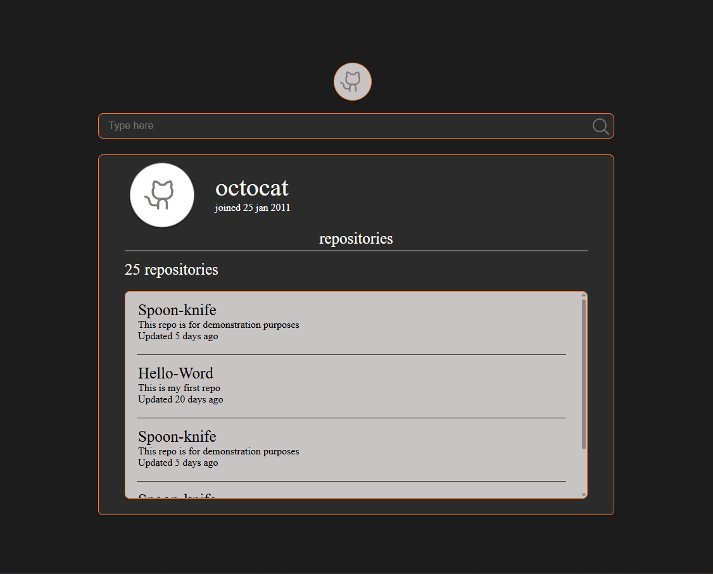

## 

🚀 GitHub Profile Finder

Uma aplicação em React.js que permite buscar perfis do GitHub e visualizar suas informações, incluindo nome, data de entrada na plataforma e lista de repositórios. Ao clicar em um repositório, o usuário é direcionado para a página correspondente no GitHub.

📦 Instalação

Clone o repositório e instale as dependências:

git clone https://github.com/seu-usuario/github-profile-finder.git
cd github-profile-finder
npm install

▶️ Executando a aplicação

Para rodar em ambiente de desenvolvimento:

npm run dev

A aplicação estará disponível em:

👉 http://localhost:5173
(ou outra porta definida pelo Vite).

⚙️ Tecnologias utilizadas

React.js (biblioteca principal)

Vite (ferramenta de build e servidor de desenvolvimento)

CSS (estilização customizada)

GitHub API (para buscar perfis e repositórios)

📖 Como funciona

Busca de perfil:

O usuário digita o nome de usuário do GitHub no campo de pesquisa.

Ao confirmar a busca, a aplicação consulta a API pública do GitHub.

Exibição do perfil:

Foto de perfil

Nome do usuário

Data de criação da conta

Exibição dos repositórios:

Lista com os repositórios públicos do usuário

Cada repositório mostra:

Título

Descrição

Última atualização

Ao clicar em um repositório, o usuário é direcionado para o GitHub.

📂 Estrutura do projeto
├── src
│ ├── assets
│ │ ├── logo-cat.svg
│ │ ├── profile.svg
│ │ └── search-icon.svg
│ ├── components
│ │ └── RepositoriesBox.jsx
│ ├── App.jsx
│ ├── App.css
│ └── main.jsx
└── package.json

🖼️ Layout

Campo de pesquisa: na parte superior.

Card de perfil: mostra avatar, nome e data de entrada.

Lista de repositórios: exibida em um box com rolagem interna.

🔮 Próximas melhorias

Conectar diretamente à API do GitHub para tornar a busca dinâmica.

Adicionar loading spinner durante a busca.

Implementar tratamento de erros (ex.: usuário não encontrado).

Melhorar responsividade para dispositivos móveis.

📜 Licença

Este projeto é open-source e pode ser utilizado livremente.
